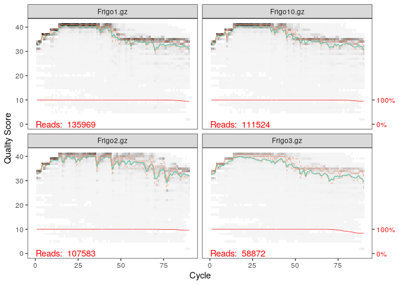
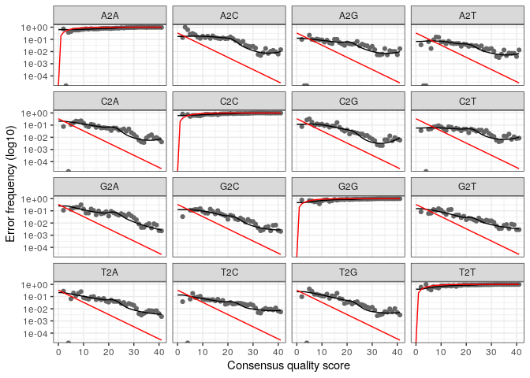

Analyse des donées avec Dada2
================
Vincent Noah
14 janvier 2021

  - [Préparation de l’environnement.](#préparation-de-lenvironnement.)
  - [Inspecter les profils de qualité des
    lectures.](#inspecter-les-profils-de-qualité-des-lectures.)
  - [Connaitre le taux d’erreur.](#connaitre-le-taux-derreur.)
  - [Inférence d’échantillon.](#inférence-déchantillon.)
  - [Alignement des R1 et R2 en
    contigs.](#alignement-des-r1-et-r2-en-contigs.)
  - [Construction de la table
    d’observation.](#construction-de-la-table-dobservation.)
  - [Détection de chimères.](#détection-de-chimères.)
  - [Pourcentage de séquences chimérique dans l’ensemble de la
    table.](#pourcentage-de-séquences-chimérique-dans-lensemble-de-la-table.)
  - [Téléchargement des bases de donées et assignation d’un
    taxonomique.](#téléchargement-des-bases-de-donées-et-assignation-dun-taxonomique.)

Cette étude est complémentaire avec celle de Logan. Nous avons pris des
placards et des frigos différents pour observer ou non s’il y à un
changement de diversité.

# Préparation de l’environnement.

``` r
library(Rcpp)
library(dada2)
```

    ## Warning: multiple methods tables found for 'which'

Les données contenues dans le dossier Data sont des séquences d’ARN 16s
obtenu à partir d’échantillon de 280 cuisines initialement. Cependant,
les temps de chargement et de traitements étaient très longs, nous avons
donc décidé de prendre 10 placards et 10 frigos différents.

``` r
path <- "~/Compte-rendu-CC3/Compte-rendu-CC3/Data"
list.files(path)
```

    ##  [1] "Frigo1.gz"    "Frigo10.gz"   "Frigo2.gz"    "Frigo3.gz"    "Frigo4.gz"   
    ##  [6] "Frigo5.gz"    "Frigo6.gz"    "Frigo7.gz"    "Frigo8.gz"    "Frigo9.gz"   
    ## [11] "Placard1.gz"  "Placard10.gz" "Placard2.gz"  "Placard3.gz"  "Placard4.gz" 
    ## [16] "Placard5.gz"  "Placard6.gz"  "Placard7.gz"  "Placard8.gz"  "Placard9.gz"

Les données étant traitées, nous ne pouvons pas savoir où sont les
forwards et où sont les reverses. On parle donc FR pour forward/Reverse

``` r
fnFRs <- sort(list.files(path, pattern=".gz", full.names = TRUE))
sample.names <- sapply(strsplit(basename(fnFRs), ".fastq.gz"), `[`, 1)
```

# Inspecter les profils de qualité des lectures.

Nous pouvons tout de même observer la qualité des reads et voir quelles
sont de bonne qualité

``` r
plotQualityProfile(fnFRs[1:4])
```

<!-- -->

# Connaitre le taux d’erreur.

``` r
errFR <- learnErrors(fnFRs, multithread=TRUE)
```

    ## 100520326 total bases in 1126370 reads from 15 samples will be used for learning the error rates.

  - La ligne noire montre le taux d’erreurs estimé avec learnErrors.

  - La ligne en rouge montre le taux d’erreur observé.

  - On observe qu’il y a peu de différence.

<!-- end list -->

``` r
plotErrors(errFR, nominalQ=TRUE)
```

    ## Warning: Transformation introduced infinite values in continuous y-axis
    
    ## Warning: Transformation introduced infinite values in continuous y-axis

<!-- -->

# Inférence d’échantillon.

Le package Dada2 contient un algorithme d’interférence, qui peut
appliquer aux données que nous possédons. Cela nous permet d’enlever les
bruits de fond, pour les R1 et les R2.

``` r
dadaFRs <- dada(fnFRs, err=errFR, multithread=TRUE)
```

    ## Sample 1 - 135969 reads in 23789 unique sequences.
    ## Sample 2 - 111524 reads in 25672 unique sequences.
    ## Sample 3 - 107583 reads in 16761 unique sequences.
    ## Sample 4 - 58872 reads in 19111 unique sequences.
    ## Sample 5 - 60153 reads in 17641 unique sequences.
    ## Sample 6 - 78671 reads in 19333 unique sequences.
    ## Sample 7 - 64253 reads in 24496 unique sequences.
    ## Sample 8 - 94640 reads in 26104 unique sequences.
    ## Sample 9 - 18552 reads in 12887 unique sequences.
    ## Sample 10 - 95263 reads in 29874 unique sequences.
    ## Sample 11 - 43341 reads in 23017 unique sequences.
    ## Sample 12 - 93491 reads in 12588 unique sequences.
    ## Sample 13 - 50059 reads in 14821 unique sequences.
    ## Sample 14 - 62174 reads in 12801 unique sequences.
    ## Sample 15 - 51825 reads in 15668 unique sequences.
    ## Sample 16 - 50702 reads in 15752 unique sequences.
    ## Sample 17 - 58483 reads in 29465 unique sequences.
    ## Sample 18 - 303893 reads in 130061 unique sequences.
    ## Sample 19 - 232066 reads in 26459 unique sequences.
    ## Sample 20 - 101287 reads in 19695 unique sequences.

# Alignement des R1 et R2 en contigs.

``` r
mergers <- dadaFRs
```

# Construction de la table d’observation.

On va maintenant créer une table de séquences grâce à la fonction
“makeSequenceTable” à partir des contigs obtenus et placé dans l’objet
mergers.

``` r
seqtab <- makeSequenceTable(mergers)
dim(seqtab)
```

    ## [1]   20 3273

# Détection de chimères.

``` r
seqtab.nochim <- removeBimeraDenovo(seqtab, method="consensus", multithread=TRUE, verbose=TRUE)
```

    ## Identified 386 bimeras out of 3273 input sequences.

``` r
dim(seqtab.nochim)
```

    ## [1]   20 2887

# Pourcentage de séquences chimérique dans l’ensemble de la table.

On peut déterminer le pourcentage du taux de chimères. On trouve qu’il y
a 5 % de séquences chimérique dans notre jeu de donnée.

``` r
1-sum(seqtab.nochim)/sum(seqtab)
```

    ## [1] 0.05600142

# Téléchargement des bases de donées et assignation d’un taxonomique.

``` bash
wget https://zenodo.org/record/3986799/files/silva_nr99_v138_train_set.fa.gz
```

``` r
taxa <- assignTaxonomy(seqtab.nochim, "~/silva_nr99_v138_train_set.fa.gz", multithread=TRUE)
```

``` bash
wget https://zenodo.org/record/3986799/files/silva_species_assignment_v138.fa.gz
```

``` r
taxa<- addSpecies(taxa, "~/silva_species_assignment_v138.fa.gz")
```

``` r
taxa.print <- taxa # Removing sequence rownames for display only
rownames(taxa.print) <- NULL
head(taxa.print)
```

    ##      Kingdom    Phylum           Class                 Order            
    ## [1,] "Bacteria" "Cyanobacteria"  "Cyanobacteriia"      "Chloroplast"    
    ## [2,] "Bacteria" "Firmicutes"     "Bacilli"             "Lactobacillales"
    ## [3,] "Bacteria" "Cyanobacteria"  "Cyanobacteriia"      "Chloroplast"    
    ## [4,] "Bacteria" "Proteobacteria" "Alphaproteobacteria" "Rickettsiales"  
    ## [5,] "Bacteria" "Proteobacteria" "Gammaproteobacteria" "Pseudomonadales"
    ## [6,] "Bacteria" "Firmicutes"     "Bacilli"             "Lactobacillales"
    ##      Family             Genus           Species
    ## [1,] NA                 NA              NA     
    ## [2,] "Streptococcaceae" "Streptococcus" NA     
    ## [3,] NA                 NA              NA     
    ## [4,] "Mitochondria"     NA              NA     
    ## [5,] "Moraxellaceae"    "Acinetobacter" NA     
    ## [6,] "Streptococcaceae" "Lactococcus"   NA

Afin de pouvoir continuer notre analyse avec phyloseq, On va réaliser
une sauvegarde, que l’on pourra charger avant l’analyse de phyloseq afin
d’avoir toutes les données.

``` r
save.image(file="02_Data-analysis-with-DADA2_FinalEnv")
```

Dada 2 nous a permis de préparer les données afin qu’ils puissent être
analysés, le plus précisément avec Phyloseq.
